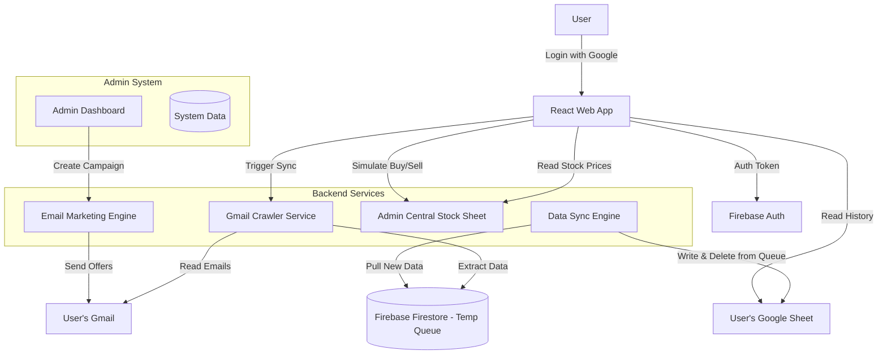

# SITEMAP & ARCHITECTURE: VIFUN FINANCE APP

## 1. Overview
**Vifun** is a "Freemium" personal finance management application that automates data entry by crawling bank transfer emails. It combines personal finance tracking with a simulated stock trading game.

**Core Philosophy:** "Privately Owned Data, Publicly Gamified." 

---

## 1.1 Monetization Strategy (Freemium)
*   **Free Tier:** 
    *   Manual Sync (Button press).
    *   Last 3 months of history.
    *   Stock Demo (Delayed quotes 15m), Limited trades/day.
    *   *Monetization:* Receives marketing emails, In-app banners.
*   **Premium Tier:** 
    *   Auto-Background Sync (Hourly).
    *   Unlimited history.
    *   Stock Demo (Real-time), Unlimited trades, Leaderboard access.
    *   Advanced Reports (PDF Export, AI Analysis).

---

## 2. High-Level Architecture (Modular Design)

To ensure scalability and ease of maintenance, the system is divided into distinct modules.

---

## 3. Site Map (User Interface)

### A. Public Layer (Public Access)
These pages are accessible without login.

1.  **Landing Page (`/`)**
    *   Hero Section: Value proposition ("Automated Finance Tracking").
    *   Features: Gmail Sync, Google Sheet Backup, Secure.
    *   **Action:** "Get Started with Google".
2.  **Authentication (`/login`)**
    *   **Component:** Google Sign-In Button (One-tap).
    *   **Permissions Request:** Grant Gmail Read & Drive File scope.
    *   Terms of Service & Privacy Policy links.
3.  **Legal Pages**
    *   `/privacy`: Privacy Policy (Crucial for Google OAuth verification).
    *   `/terms`: Terms of Service.

### B. User Dashboard (Secured Layer)
Accessible only after Google Login. Data is fetched from **Firestore** (User-specific collection).

1.  **Dashboard (`/dashboard`)**
    *   **Overview Cards:** Total Balance, Income vs Expense (This Month).
    *   **Recent Transactions:** List of latest 5-10 transactions.
    *   **Sync Status:** Indicator showing when data was last crawled from Gmail/synced to Sheet.
    *   **Action:** "Sync Now" button.
2.  **Stock Market Demo (`/stocks`)**
    *   **Price Board:** Real-time stock prices (VNIndex, VN30) fetched from Admin's Google Sheet `GOOGLEFINANCE()` function.
    *   **Trading Simulator:** Buy/Sell interface (Demo money).
    *   **My Portfolio:** Tracks demo stocks owned by user.
    *   **Note:** Data is centralized on the Admin Sheet, not User's personal sheet.
3.  **Transactions (`/transactions`)**
    *   **Full List:** Searchable, filterable table of all bank transfers.
    *   **Edit/Categorize:** User can manually edit categories if auto-detect fails.
4.  **Reports (`/reports`) [PREMIUM FEATURE]**
    *   **Basic:** Income vs Expense (Free).
    *   **Advanced:** Trend analysis, Category breakdown, Year-over-Year comparison (Paid).
    *   **Export:** PDF/Excel download (Paid).
5.  **Settings & Billing (`/settings`)**
    *   **Data Source:** Link to the specific **Google Sheet**.
    *   **Plan Management:** Upgrade to Premium, View Invoice History.
    *   **Profile:** Google Account info.

### C. Admin Portal (System Layer)
Accessible only to Admins. Data stored in **Firestore (System/Admin Collections)**.

1.  **User Management (`/admin/users`)**
    *   List of registered users.
    *   **Filter:** Free vs Premium.
    *   **Action:** Gift Premium, Suspend User.
2.  **Marketing Hub (`/admin/marketing`)**
    *   **Email Campaigns:** Compose HTML emails sent to "Free Users" or "All Users".
    *   **Templates:** "Upgrade Now", "Monthly Recap", "Stock Tips".
    *   **Analytics:** Open Rate (tracked via pixel), Click Rate.
3.  **System Config (`/admin/config`)**
    *   Crawler Regex Rules.
    *   **Pricing Config:** Manage plan features and pricing strings.

---

## 4. Technical Modules (For Maintainability)

We will separate code logically to allow easy upgrades.

### 1. Authentication Module (`/src/auth`)
*   **Responsibility:** Handle Google Sign-In, Refresh Tokens.
*   **Storage:** Stores User Profile in Firestore `users/{uid}`.
*   **Key File:** `AuthProvider.jsx` (Context).

### 2. Crawler Module (`/src/services/crawler`)
*   **Responsibility:** 
    *   Connect to Gmail API (`https://www.googleapis.com/auth/gmail.readonly`).
    *   Parse emails based on RegEx patterns (Vietcombank, Techcombank, etc.).
    *   Return standardized transaction objects.
*   **Key File:** `gmailParser.js`.

### 3. Database Module (`/src/services/db`)
*   **Responsibility:** 
    *   **Firestore Client:** Acts as a **Temporary Buffer/Queue** for newly crawled data.
    *   **Sheet Sync Client:** Moves data from Firestore -> Google Sheet -> Deletes from Firestore.
    *   **Sheet Read Client:** Fetches transaction history directly from User's Google Sheet for the Frontend.
*   **Key Flow:** Data -> Firestore (Temp) -> Google Sheet (Permanent) -> Frontend (Read).

### 4. Stock Market Service (`/src/services/stocks`)
*   **Responsibility:**
    *   Fetch live prices from **Admin's Central Sheet** (via Apps Script API).
    *   Execute mocked Buy/Sell orders (record transaction in Admin Sheet).
*   **Note:** Low security, demo purposes only.

### 5. Admin Module (`/src/admin`)
*   **Responsibility:** Manage system-wide settings.
*   **Security:** Protected byFirestore Security Rules (only `admin` role can read/write).

---

## 5. Data Flow (Privacy Focused)

1.  **Login:** User grants permission.
2.  **Setup:** App checks if `Vifun_Finance_Data` Sheet exists in User's Drive. If not, create it.
3.  **Crawl:** App reads Gmail -> Extracts Bank Data.
4.  **Queue:** Save extracted data to Firestore `users/{uid}/queue`.
5.  **Sync & Cleanup:** Apps Script reads Queue -> Appends to Google Sheet -> **Deletes from Firestore**.
6.  **Display:** User visits `/dashboard`, app queries **User's Google Sheet** directly via API to show history.
    *   *Benefits:* Zero storage cost for DB, User has 100% control of data.
7.  **Stock Demo:**
    *   Connects to Public Admin API (Apps Script).
    *   Reads/Writes to "Central Stock Sheet".
    *   Shared environment for all simulated traders.

---

## 6. Project Progress & Notes

### Phase 1: Authentication & Data Flow [IN PROGRESS]
- [x] **Folder:** Created `src/stitch_designs` for external design imports.
- [x] **Component:** Create new premium Login UI.
- [x] **Firebase Setup:** Project `vifun-finance` created, Firestore & Auth services active.
- [x] **Google OAuth:** Authorized JavaScript origins and Redirect URIs configured for `localhost:3000/5173`.
- [x] **Success:** User successfully logged in and authenticated.
- [ ] **Sync Engine:** Implement GAS logic to pull from Firestore to Sheet.
- [ ] **Cleanup:** GAS logic to delete from Firestore after sync.

### Phase 2: Stock Market Demo [PLANNED]
- [ ] Centralized Admin Sheet setup.
- [ ] Trading API on GAS.
- [ ] Frontend Trading UI.

### Phase 3: Admin & Marketing [PLANNED]
- [ ] Admin Dashboard UI.
- [ ] Email Marketing System.
- [ ] User Tier Management.

---
*Last Updated: 2026-02-07*
